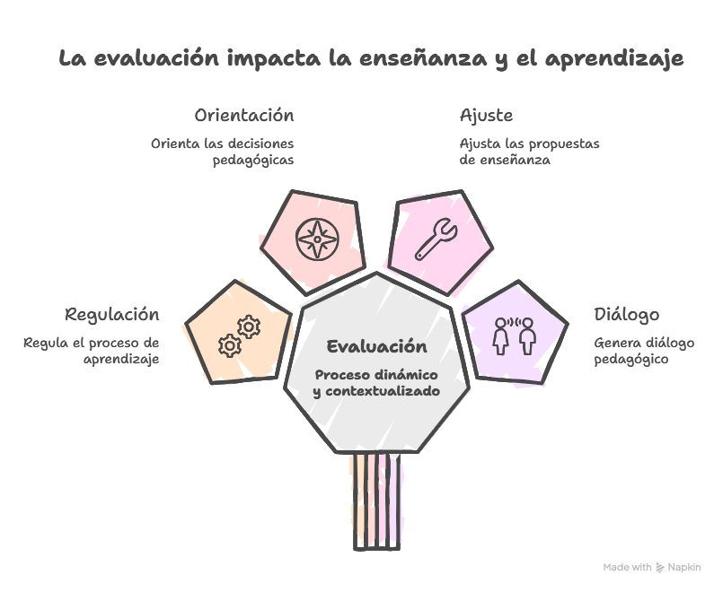
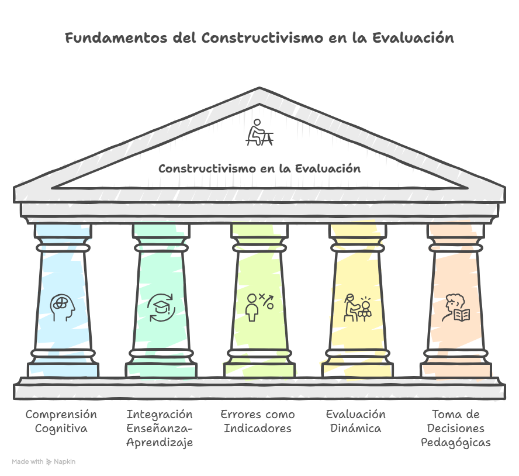
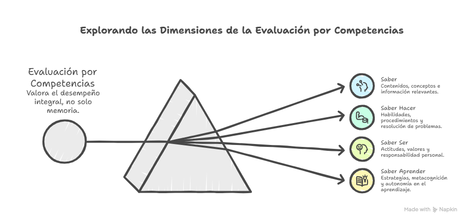

---
markmap:
  colorFreezeLevel: 2
  initialExpandLevel: 2
  maxWidth: 220
  
---

# Mapa conceptual: la evaluación educativa

## 1. ¿Qué es evaluación y cuál es su relación con la enseñanza y el aprendizaje?

### Evaluación como proceso dinámico y contextualizado

-  <small><i>Figura 1: Dimensión contextual y dinámica del proceso evaluativo.</i></small>

### Concepto
- **Castillo Arredondo y Cabrerizo Diago**
  - La evaluación es un proceso **dinámico, abierto y contextualizado**, situado en una realidad educativa concreta.
- **Tenbrink**
  - Evaluar supone tres operaciones articuladas:
    - obtener información rigurosa
    - formular juicios de valor fundados
    - tomar decisiones

### Relación con la enseñanza y el aprendizaje
- **Álvarez Méndez**
  - La evaluación no debe entenderse como una instancia separada del aprendizaje, sino como parte de su desarrollo.
- **Celman**
  - La evaluación puede ser una **herramienta de conocimiento** cuando ayuda a comprender y mejorar lo que ocurre en la enseñanza.
- **Castillo Arredondo y Cabrerizo Diago**
  - La evaluación funciona como un **punto de encuentro didáctico** entre docente, alumno, enseñanza y aprendizaje.
- **Litwin**
  - Evaluar implica atribuir valor a la enseñanza y al aprendizaje dentro de situaciones concretas.

### Idea central
- La evaluación **no es ni puede ser un apéndice** de la enseñanza ni del aprendizaje.
- Es parte **constitutiva e indisociable** de ambos.
- Permite:
  - regular el proceso
  - orientar decisiones
  - ajustar propuestas
  - generar diálogo pedagógico

## 2. ¿Para qué y por qué evaluar?

### Por qué evaluar
- **Cardona**
  - La evaluación cumple distintas funciones según el momento y la finalidad del proceso educativo.
- **Scriven**
  - Diferencia especialmente entre evaluación **formativa** y **sumativa**, según se oriente a mejorar el proceso o valorar resultados.

### Funciones principales
- **Función diagnóstica**
  - Permite conocer el punto de partida del alumno y orientar la enseñanza.
- **Función formativa o reguladora**
  - Acompaña el proceso y permite realizar ajustes mientras el aprendizaje está ocurriendo.
- **Función sumativa**
  - Valora los resultados alcanzados al cierre de un proceso.

### Para qué evaluar
- **Tenbrink**
  - Se evalúa para tomar decisiones basadas en información confiable.
- **Celman**
  - La finalidad más potente de la evaluación es comprender profundamente el proceso para mejorarlo.

### Finalidades
- Tomar decisiones pedagógicas.
- Adecuar la actuación didáctica a necesidades y ritmos del alumnado.
- Promover aprendizajes a partir de los errores.
- Calificar.
- Facilitar la promoción.
- Acreditar o titular saberes alcanzados.
- Transformar la evaluación en una **herramienta de conocimiento**.

## 3. Toma de decisión pedagógica/didáctica y concepción del aprendizaje: el constructivismo

### Fundamentos del constructivismo en la evaluación

-  <small><i>Figura 2: Integración constructivista entre enseñanza, aprendizaje y error formativo.</i></small>

### Qué plantea el constructivismo
- **Allal**
  - La evaluación debe centrarse en comprender el funcionamiento cognitivo del alumno frente a la tarea.
- **Díaz Barriga**
  - No debería existir una ruptura entre la manera de enseñar, la manera de aprender y la manera de evaluar.

### El error desde una mirada constructivista
- **Allal**
  - Los errores no son simples fracasos, sino indicadores de las representaciones, hipótesis y estrategias del alumno.
- Permiten observar:
  - cómo piensa el alumno
  - qué estrategias utiliza
  - qué obstáculos aparecen
  - qué tipo de ayuda necesita

### Evaluación dinámica
- **Newman, Griffin y Cole**
  - La evaluación puede centrarse en la interacción entre profesor y alumno, observando cómo el estudiante avanza con ayuda.
- **Vigotsky**
  - La zona de desarrollo próximo permite pensar la evaluación como una intervención sobre lo que el alumno puede lograr con acompañamiento.

### Toma de decisión pedagógica
- El docente no se limita a medir un producto final estático.
- Toma decisiones durante el proceso.
- Puede brindar:
  - pistas
  - indicaciones
  - preguntas orientadoras
  - andamiajes
- El objetivo es que el alumno pueda continuar su labor de forma cada vez más independiente.
- Se favorece:
  - modificabilidad
  - autonomía
  - disponibilidad para aprender

## 4. Relación con el enfoque de evaluación que propone la materia

### Evaluación auténtica
- **Herman, Aschbacher y Winters**
  - La evaluación auténtica propone tareas complejas, activas y cercanas a situaciones de la vida real.
- **Díaz Barriga**
  - Desde la perspectiva situada, evaluar implica valorar desempeños en contextos significativos.

### Evaluación por competencias
-  <small><i>Saberes integrados en el enfoque basado en competencias.</i></small>

- **Castillo Arredondo y Cabrerizo Diago**
  - La evaluación por competencias busca valorar el desempeño integral, no solo la memoria o la repetición de contenidos.
- Evalúa:
  - **Saber**
    - contenidos
    - conceptos
    - información
  - **Saber hacer**
    - habilidades
    - procedimientos
    - resolución de problemas
  - **Saber ser**
    - actitudes
    - valores
    - responsabilidad
  - **Saber aprender**
    - estrategias
    - metacognición
    - autonomía

### Evaluación formadora
- **Jorba y Sanmartí**
  - La evaluación formadora promueve que el alumno aprenda a regular su propio proceso de aprendizaje.
- Implica transferir gradualmente responsabilidad desde el docente hacia el alumno.
- Favorece:
  - autorregulación
  - autoevaluación
  - metacognición
  - mejora autónoma

## 5. Respuesta a preguntas clásicas sobre la evaluación

### ¿Qué evaluar?
- **Castillo Arredondo y Cabrerizo Diago**
  - Se evalúa el grado de adquisición de competencias básicas, considerando aprendizajes, procesos y resultados.
- Se evalúan:
  - conocimientos
  - habilidades
  - actitudes
  - valores
  - agentes
  - procesos
  - resultados evidenciables

### ¿Cómo evaluar?
- **Castillo Arredondo y Cabrerizo Diago**
  - La evaluación requiere metodologías variadas, innovadoras y adecuadas a cada situación.
- Puede realizarse mediante procedimientos:
  - cuantitativos
  - cualitativos
- Debe fomentar:
  - creatividad
  - resolución de situaciones
  - aplicación de saberes
  - reflexión sobre el proceso

### ¿Cuándo evaluar?
- **Castillo Arredondo y Cabrerizo Diago**
  - La evaluación debe ser continua y desarrollarse en distintos momentos del proceso.
- Momentos:
  - **Antes del proceso**
    - evaluación inicial
    - evaluación diagnóstica
  - **Durante el proceso**
    - evaluación procesual
    - evaluación reguladora
    - evaluación formativa
  - **Al final del proceso**
    - evaluación final
    - evaluación sumativa

### ¿Con qué evaluar?
- **Castillo Arredondo y Cabrerizo Diago**
  - Los instrumentos deben ser variados, pertinentes y adecuados a la situación evaluativa.
- Técnicas:
  - observación
  - interrogación
  - análisis de producciones
  - resolución de problemas
- **Ahumada**
  - Las rúbricas o matrices de valoración permiten explicitar criterios y niveles de desempeño.
- **Airasian**
  - El portafolio permite reunir evidencias del aprendizaje y observar su evolución.
- **Arends**
  - Los instrumentos deben ser coherentes con los objetivos, las actividades y los aprendizajes esperados.
- **McKeachie**
  - Los portafolios favorecen la reflexión del estudiante sobre su propio proceso.

### Instrumentos posibles
- Rúbricas o matrices de valoración.
- Portafolios.
- Guías de observación.
- Listas de cotejo.
- Producciones escritas.
- Presentaciones orales.
- Proyectos.
- Trabajos colaborativos.

### ¿Quién evalúa?
- **Castillo Arredondo y Cabrerizo Diago**
  - La evaluación puede ser realizada por distintos agentes, según la función que cumplan en el proceso.
- Evalúan:
  - profesores
  - alumnos
  - pares
  - institución
  - administración educativa

### Modalidades complementarias
- **Heteroevaluación**
  - El profesor evalúa el proceso o la producción del alumno.
- **Autoevaluación**
  - El alumno analiza y valora su propio aprendizaje.
- **Coevaluación**
  - Los pares participan en la valoración de procesos o producciones.

## 6. Idea integradora

### Evaluar para comprender, decidir y mejorar
- La evaluación no se reduce a medir.
- Tampoco se limita a calificar.
- Su sentido pedagógico aparece cuando permite:
  - comprender procesos
  - tomar decisiones fundamentadas
  - mejorar la enseñanza
  - mejorar los aprendizajes
  - favorecer la autonomía

### Síntesis
- Evaluar es mirar el proceso con intención pedagógica.
- Es construir información valiosa para intervenir mejor.
- Es acompañar el aprendizaje como quien enciende una linterna en medio del camino, no como quien solo cuenta los pasos al final.

## 7. Mirada personal

### El _**corpus delicti**_  evaluativo

-  <small><i>La imagen muestra mi primera evaluación, según la consigné en la presentación de esta materia.</i></small>
- Para mí, una evaluación pedagógica no debería ser un **martillo** que cae sobre el error, sino una **linterna** que permite ver mejor el camino.
- Si solo devuelve una nota, califica sin enseñar.
- Si ofrece retroalimentación, puede ayudar a comprender qué pasó, qué se necesidad y cómo seguir aprendiendo.